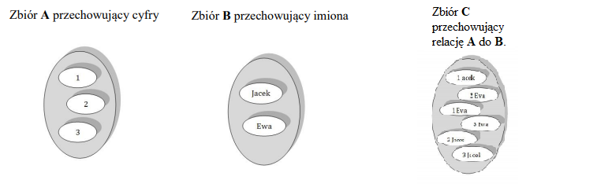

# Wprowadzenie do SQL

**SQL** _(Structured Query Language)_ _(pol. Strukturalny Język Zapytań)_- Język używany do zarządzania bazami danych.

### Składnia języka SQL:
> - SQL DML - _(Data Manipulation Language)_ język manipulacji danymi. Najważniejsze polecenia to: **INSERT**, **UPDATE**, **DELETE**.
> - SQL DDL - _(Data Definition Language)_ utworzenie struktury; operowanie na strukturach.
Najważniejsze polecenia to: **CREATE**, **DROP**, **ALTER**.
> - SQL DCL - _(Data Control Language)_ nadawanie uprawnień do obiektów bazodanowych. Najważniejsze polecenia to: **GRANT**,**REVOKE**,**DENY**.
> - SQL DQL - _(Data Query Language)_ - język formułowania zapytań do bazy danych.
Polecenie **SELECT**.  

### Programy do zarządzania bazami danych:
> - **dBase** - jeden z pierwszych programów do zarządzania bazami danych. Baza Danych znajduje się w plikach typu **.db**.
> - **MySQL** - wolnodostępny, otwartoźródłowy system zarządzania relacyjnymi bazami danych.


**Encja** _(ang. entity)_ – reprezentacja wyobrażonego lub rzeczywistego obiektu (grupy obiektów) stosowana przy modelowaniu danych podczas analizy informatycznej.
Przykłady encji (i atrybuty w encji) – nazwy encji zgodnie z zaleceniem Barkera to rzeczowniki w liczbie mnogiej:
- Osoby (imię, nazwisko, PESEL)
- Pojazdy (wysokość, szerokość, długość, sposób poruszania się)
<!--  What the fuck is this ^^^ -->
**Relacją** nazywamy podzbiory iloczynu kartezjańskiego. 


### Kwerendy
#### Składnia zapytań SQL
```SQL
SELECT FROM <WHERE> <GROUP BY> <HAVING> <ORDER BY>
```

> SELECT - Określa kształt wyniku, kolumny, itp.
> FROM - Określa źródła i relacje między nimi 
> WHERE - filtracja rekordów
> GROUP BY - grupowanie rekordów
> HAVING - filtrowanie grup
> ORDER BY - sortowanie wyniku
