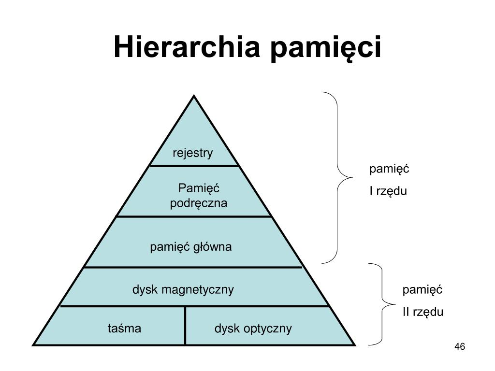

# Przestrzeń Wymiany

### ⬆️ krótszy czas dostępu | ⬇️ większy rozmiar

#### Partycja **swap** to przestrzeń wymiany:
> - przyspiesza przenoszenie do RAMu
> - umożliwia trwałe usunięcie danych
> - minimalizacja uszkodzenia partycji z danymi
> - jest podzielną partycją