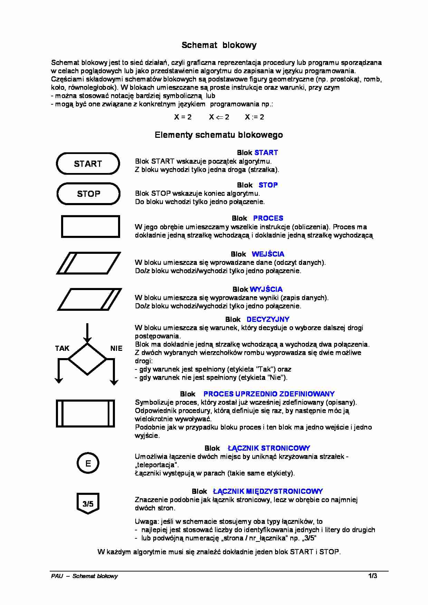

 **Algorytm** - Zbiór reguł rozwiązania danego zadania w skończonej liczbie kroków (uporządkowany ciąg jasno zdefiniowanych czynności, koniecznych do wykonywania pewnego rodzaju zadań).
 ## Algorytm musi być:
 - jednoznaczny (te same dane - ten sam wynik)
 - poprawny (dla każdego zestawu danych wynik jest poprawny)
 - Szczegółowy
 - masowy(uniwersalny)

 .223


```
 Algorytm = (Dane, Instrukcje, Wynik)
```


- blok owalny - *_etykieta_*

- blok we/wy - w

- blok operacyjny/wykonawczy/obliczeniowy - *_operand_*

- blok warunkowy - *_predykat_*


