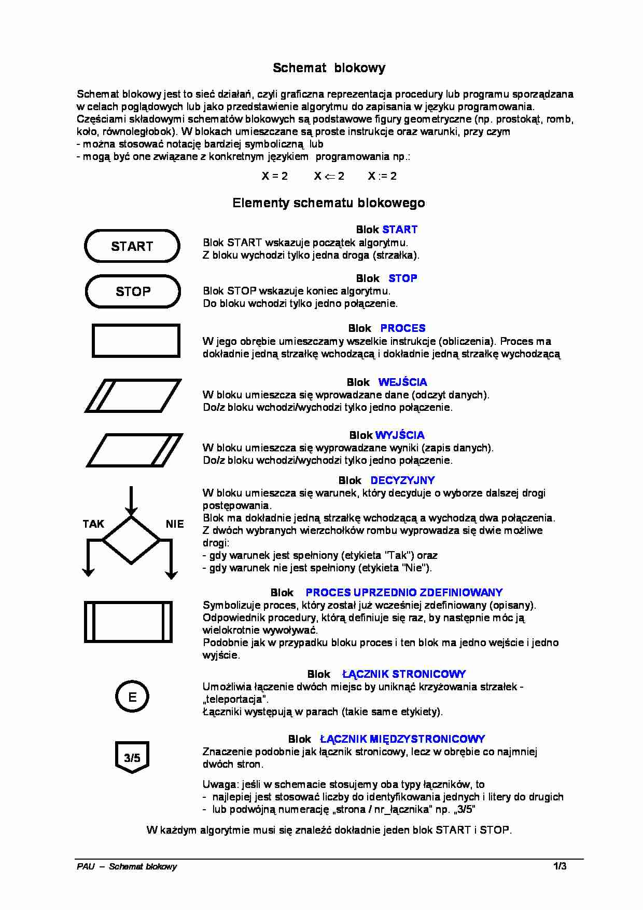

 # Algorytmika i schemat blokowy
 **Algorytm** - Zbiór reguł rozwiązania danego zadania w skończonej liczbie kroków (uporządkowany ciąg jasno zdefiniowanych czynności, koniecznych do wykonywania pewnego rodzaju zadań).

#### Algorytm musi być:

> -   jednoznaczny (te same dane - ten sam wynik)
> -   poprawny (dla każdego zestawu danych wynik jest poprawny)
> -   Szczegółowy
> -   Masowy (uniwersalny)

.223 /_wtf does that even mean_/

* * *

<table>
  <tr>
    <th colspan="3">
Algorytm
</th>
  </tr>
  <tr>
    <td> Dane </td><td> Instrukcje </td><td> Wynik </td>
  </tr>
</table>

* * *

-   blok owalny - **etykieta**

-   blok we/wy - **zapis/odczyt**

-   blok operacyjny/wykonawczy/obliczeniowy - **operand**

-   blok warunkowy - **predykat**

